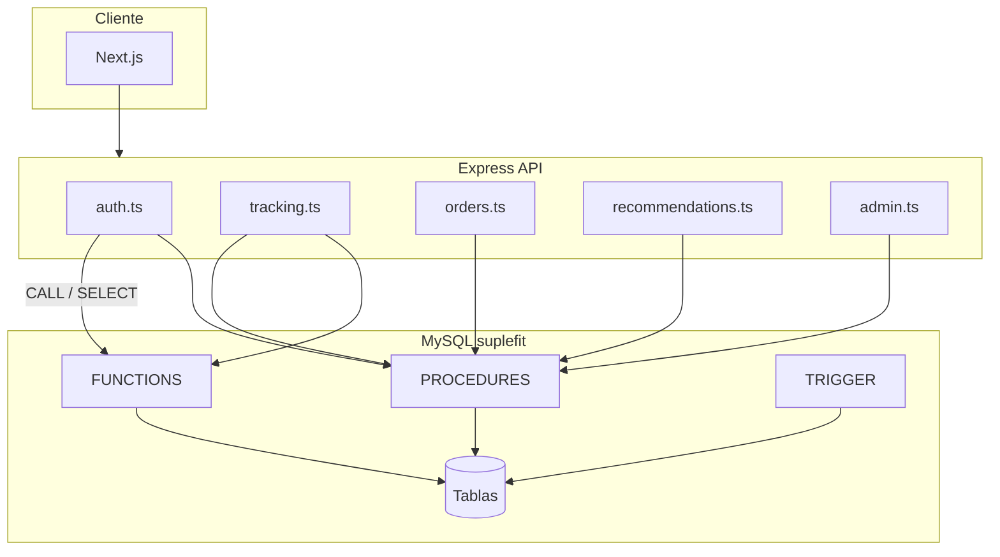
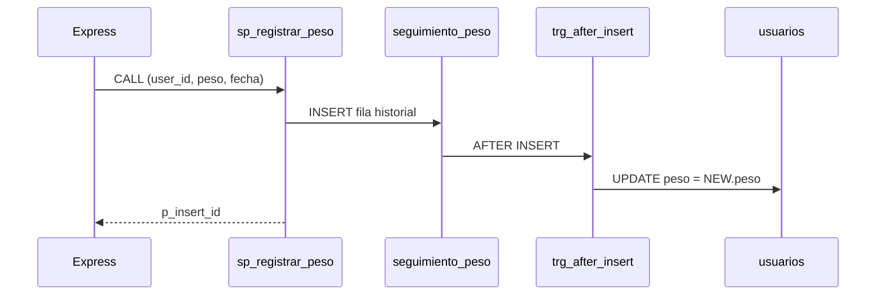
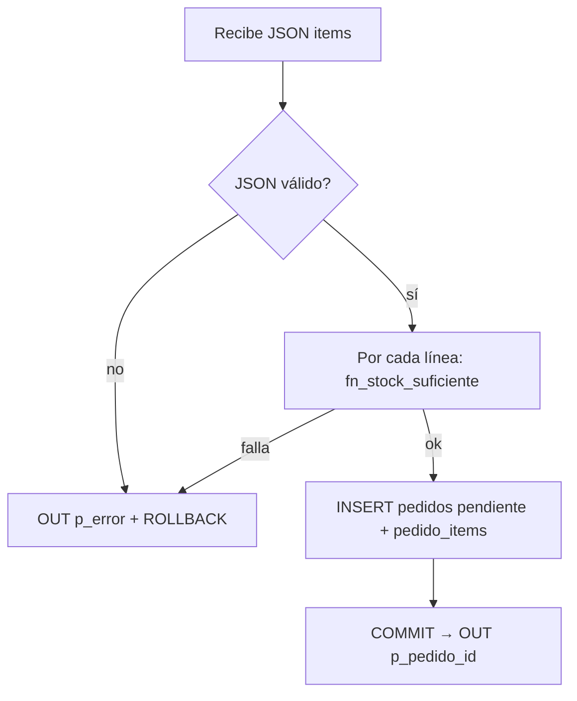
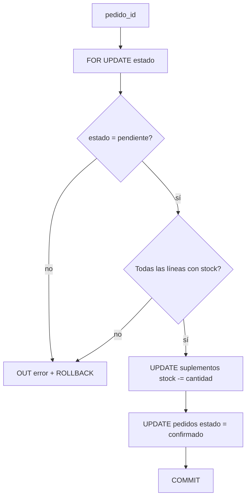

# Base de datos SupleFit — Rutinas MySQL y flujo de datos

Documentación académica de las **funciones**, **procedimientos almacenados** y **trigger** que ejecutan reglas de negocio en el motor MySQL. La API Express sigue siendo delgada: valida con Zod, autentica con JWT y delega la persistencia crítica mediante `CALL` y `SELECT fn_...()`.

**Script de instalación:** `apps/api/db/migrations/003_stored_routines.sql`  
**Aplicación automática:** `apps/api/scripts/db-reset.sh` (tras `schema.sql`)

---

## Arquitectura general



### Qué permanece en Node (fuera de MySQL)

| Responsabilidad | Motivo |
|-----------------|--------|
| Hash de contraseña (`bcrypt`) | No debe vivir en SQL |
| Emisión y verificación JWT | Capa de aplicación |
| Validación de entrada (Zod) | Contratos HTTP |
| CORS, URLs de imágenes | Infraestructura web |

---

## Tabla auxiliar: `reglas_objetivo_categoria`

Alimenta `sp_generar_recomendaciones` con el mismo mapeo que `recommendationRules.ts`, pero **persistido en BD** para que el tribunal pueda inspeccionar reglas con SQL.

| Columna | Descripción |
|---------|-------------|
| `objetivo` | Clave del perfil (`ganar_masa_muscular`, `perder_grasa`, …) |
| `categoria_slug` | Slug en `categorias.slug` |
| `prioridad` | Orden de preferencia (menor = más prioritario) |
| `omitir_si_sedentario` | `1` excluye la categoría si `nivel_actividad` ∈ sedentario, baja, media |

---

## Funciones (7)

Todas son de **solo lectura** y pueden invocarse en `SELECT`.

| Función | Parámetros | Retorno | Caso de uso / endpoint |
|---------|------------|---------|------------------------|
| `fn_calcular_imc` | peso, altura | `DECIMAL` o `NULL` | `GET /api/auth/me`, `GET /api/users/profile` |
| `fn_clasificar_imc` | imc | `VARCHAR` (`bajo_peso`, `normal`, …) | Misma respuesta de perfil |
| `fn_delta_peso_reciente` | `user_id` | Diferencia últimos 2 registros | Usada en `sp_resumen_seguimiento_7d` |
| `fn_peso_inicial_usuario` | `user_id` | Primer peso del historial | Dashboard / informes |
| `fn_stock_suficiente` | `supplement_id`, cantidad | `0`/`1` | Usada en `sp_crear_pedido` y `sp_confirmar_pedido` |
| `fn_usuario_es_admin` | `user_id` | `0`/`1` | `POST /api/auth/login` |
| `fn_resumen_peso` | `user_id` | JSON `{pesoActual, pesoInicial, deltaReciente}` | `GET /api/auth/me` |

### Ejemplos en consola MySQL

```sql
SELECT fn_calcular_imc(75, 1.75) AS imc;
SELECT fn_clasificar_imc(fn_calcular_imc(75, 1.75)) AS etiqueta;
SELECT fn_stock_suficiente(1, 2) AS hay_stock;
SELECT fn_resumen_peso(1) AS resumen;
```

### Lógica destacada

**IMC:** `peso / (altura²)`, redondeo a 1 decimal; `NULL` si altura ≤ 0.

**Clasificación OMS (simplificada):** &lt;18.5 bajo peso; 18.5–24.9 normal; 25–29.9 sobrepeso; ≥30 obesidad.

**Delta de peso:** ordena `seguimiento_peso` por `created_at DESC`, toma los dos primeros y resta.

---

## Procedimientos almacenados (9)

| Procedimiento | Endpoint API | Transacción | Descripción |
|---------------|--------------|-------------|-------------|
| `sp_registrar_usuario` | `POST /api/auth/register` | Sí | `INSERT` usuario + primer registro en `seguimiento_peso`; `OUT p_user_id` |
| `sp_registrar_peso` | `POST /api/tracking/peso` | No* | `INSERT` historial; `OUT p_insert_id` |
| `sp_guardar_habito_diario` | `POST /api/tracking/habitos` | No | `INSERT … ON DUPLICATE KEY UPDATE` |
| `sp_resumen_seguimiento_7d` | `GET /api/tracking/resumen` | No | Entrenos 7d, media hidratación, delta peso (`OUT` ×3) |
| `sp_crear_pedido` | `POST /api/orders` | Sí | Valida stock, calcula total, pedido `pendiente`; `OUT p_pedido_id`, `p_error` |
| `sp_generar_recomendaciones` | `GET /api/recommendations` | No | Borra recs del día, inserta top 6 por reglas SQL |
| `sp_eliminar_cuenta_usuario` | `DELETE /api/users/profile` | Sí | Borrado en cascada ordenado |
| `sp_confirmar_pedido` | `POST /api/admin/orders/:id/confirm` | Sí | **Nuevo:** descuenta stock y pasa a `confirmado` |
| `sp_estadisticas_admin` | `GET /api/admin/stats` | No | **Nuevo:** contadores globales (`OUT` ×6) |

\* La coherencia de `usuarios.peso` la garantiza el trigger (ver abajo).

### Flujo: `sp_registrar_peso` + trigger



### Flujo: `sp_crear_pedido` (sin bajar stock)



El stock **no** se descuenta al crear el pedido; solo se valida disponibilidad. El descuento ocurre en `sp_confirmar_pedido`.

### Flujo: `sp_confirmar_pedido` (funcionalidad nueva)



**Ejemplo admin:**

```http
POST /api/admin/orders/12/confirm
Authorization: Bearer <token_admin>
```

### Flujo: `sp_generar_recomendaciones`

1. Lee `objetivo` y `nivel_actividad` de `usuarios`.
2. Calcula flag sedentario (nivel ∈ sedentario, baja, media).
3. `DELETE` recomendaciones del usuario con `DATE(created_at) = CURDATE()`.
4. `INSERT` hasta 6 suplementos uniendo `reglas_objetivo_categoria` → `categorias` → `suplementos`, respetando `omitir_si_sedentario`, orden por prioridad, stock y precio.

### Flujo: `sp_eliminar_cuenta_usuario`

Orden de borrado: `pedido_items` → `pedidos` → `recomendaciones` → `seguimiento_peso` → `habitos_diarios` → `administradores` → `usuarios`.

---

## Trigger

| Nombre | Evento | Efecto |
|--------|--------|--------|
| `trg_seguimiento_peso_after_insert` | `AFTER INSERT` en `seguimiento_peso` | `UPDATE usuarios SET peso = NEW.peso` |

Alternativa documentada al `UPDATE` manual que había en la API: cualquier inserción en el historial (registro, migración, `sp_registrar_usuario`) mantiene sincronizado el peso actual del perfil.

---

## Integración en Express

Helpers en `apps/api/src/lib/db.ts`:

- `queryScalar(sql)` — funciones en `SELECT fn_...(?) AS v`
- `callProcedure(name, inParams, outNames)` — `CALL` + lectura de `@variables`

Ejemplo registro:

```typescript
await callProcedure("sp_registrar_usuario", [nombre, correo, hash, ...], ["p_user_id"]);
```

Ejemplo pedido:

```typescript
const out = await callProcedure(
  "sp_crear_pedido",
  [userId, JSON.stringify(items)],
  ["p_pedido_id", "p_error"]
);
```

---

## Verificación para memoria / defensa

```sql
SHOW FUNCTION STATUS WHERE Db = 'suplefit';
SHOW PROCEDURE STATUS WHERE Db = 'suplefit';
SHOW TRIGGERS FROM suplefit;

-- Casos borde
SELECT fn_calcular_imc(70, 0);          -- NULL
SELECT fn_delta_peso_reciente(99999);   -- NULL sin historial

-- Pedido con stock insuficiente (debe devolver error sin filas huérfanas)
SET @items = JSON_ARRAY(JSON_OBJECT('supplementId', 1, 'cantidad', 99999));
CALL sp_crear_pedido(1, @items, @pid, @err);
SELECT @pid, @err;
```

Pruebas desde la aplicación: registro, registrar peso, resumen 7d, crear pedido, confirmar pedido (admin), estadísticas admin, recomendaciones, borrar cuenta.

---

## Orden de despliegue

1. `schema.sql` — tablas base  
2. `003_stored_routines.sql` — rutinas + `reglas_objetivo_categoria`  
3. Seed (`pnpm seed` o `db-reset.sh`) — catálogo y admin  

En bases ya existentes sin reset:

```bash
mysql -u ... suplefit < apps/api/db/migrations/003_stored_routines.sql
mysql -u ... suplefit < apps/api/db/migrations/004_collation_unicode.sql
mysql -u ... suplefit < apps/api/db/migrations/003_stored_routines.sql
```

La migración `004` evita el error *Illegal mix of collations* entre tablas (`uca1400`) y la sesión del API (`unicode_ci`). El `db-reset.sh` aplica `004` automáticamente.
